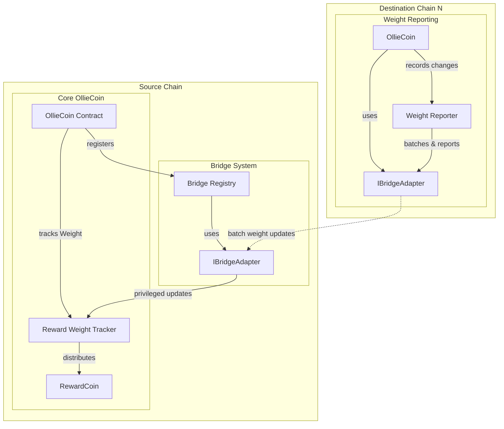
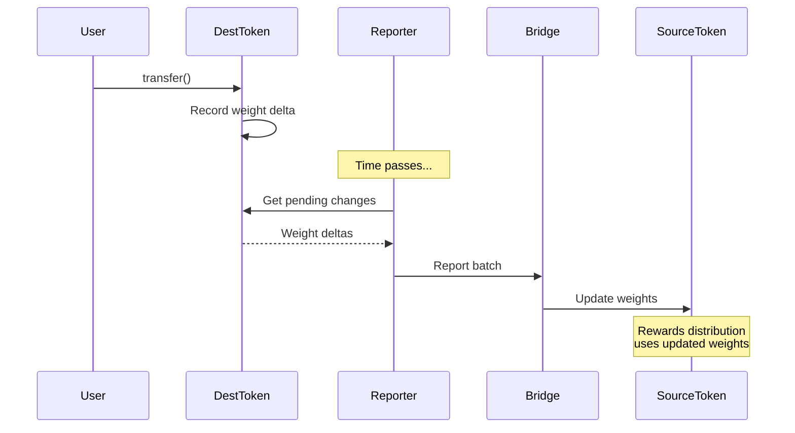

# OllieCoin Documentation

OllieCoin is a smart contract implementation that enables periodic reward distributions to token holders. It features a sophisticated reward tracking system with delegation capabilities and preservation mechanics.

## Overview

OllieCoin extends the standard ERC20 token with the following key features:

- Periodic reward distributions to token holders
- Historical balance tracking using checkpoints
- Reward weight delegation system
- Reward weight preservation during transfers
- Claiming mechanism for accumulated rewards

## Prerequisites

- [Foundry](https://book.getfoundry.sh/getting-started/installation.html)
- Solidity ^0.8.20
- OpenZeppelin Contracts

## Installation

1. Clone the repository:
```bash
git clone https://github.com/skimaharvey/convexity-task
cd convexity-task
```

2. Install dependencies:
```bash
forge install
```

## Contract Structure

The main components of OllieCoin are:

- `OllieCoin.sol`: Main token contract
- `RewardCoin.sol`: The reward token contract
- Tests in `test/` directory

## Key Features

### 1. Reward Distribution System
- Owner can distribute reward tokens periodically using `distribute()`
- O(1) time complexity for distributions

### 2. Reward Claiming
- Users can claim accumulated rewards using `claim()`
- Claims can be made at any time after distribution
- Rewards are preserved even after token transfers
- O(n) time complexity where n is the number of distribution periods

### 3. Delegation System
- Users can delegate their reward weight to other addresses
- Delegation does not affect token ownership
- Historical reward weight is tracked using checkpoints

### 4. Reward weight Preservation
- Allows specific addresses to transfer tokens without affecting reward weight
- Useful for integration with bridges and other protocols
- Configurable per spender address

## Running Tests

```bash
# Run all tests
forge test

# Run specific test
forge test --match-test testDistributions

# Run tests with gas reporting
forge test --gas-report

# Run tests with verbose output
forge test -vv
```

## Main Functions

### For Token Holders

```solidity
// Claim accumulated rewards
function claim() external

// Delegate reward weight
function delegateRewards(address delegatee) public

// Set reward weight preservation for a spender
function setRewardWeightPreservation(address spender, bool preserve) external

// Transfer without affecting reward delegation
function transferWithoutRewardDelegation(address to, uint256 amount) external
```

### For Contract Owner

```solidity
// Distribute rewards
function distribute(ERC20 token, uint256 amount) external onlyOwner

// Mint new tokens (for testing)
function mint(address to, uint256 amount) external onlyOwner
```

### View Functions

```solidity
// Get pending rewards
function getPendingRewards(address account) external view returns (uint256)

// Get current reward weight
function getRewardWeight(address account) public view returns (uint256)

// Get historical reward weight
function getPastRewardWeight(address account, uint48 timestamp) public view returns (uint256)
```

### Reward Weight System

The reward weight system tracks how many rewards each token holder should receive. I built this system based on OpenZeppelin's voting system because it's a proven and efficient way to track historical data.

#### How it Works

The system uses checkpoints to record changes in users' reward weights. A checkpoint is created whenever someone's reward weight changes through transfers or delegations. Each checkpoint records the user's reward weight at that specific time.

Example of checkpoints for a user:
```
Alice's Reward Weight History:
January 1: 100 tokens
January 15: 150 tokens (received 50)
January 30: 120 tokens (sent 30)
```

When calculating rewards, we use these checkpoints to determine exactly how many tokens someone had during any distribution period.

### Benefits

1. **Accurate History**
   - Precise tracking of token holdings over time
   - Ensures fair reward distribution
   - Supports delegation

2. **Efficient**
   - Records only change points, not continuous state
   - Fast reward calculations
   - Scales well with user growth and frequent transfers


### DeFi Protocol Integration

OllieCoin's architecture separates token ownership from reward weight through its delegation and preservation system, making it particularly suitable for integration with various DeFi protocols.

#### Integration Examples

##### 1. Lending Protocols
When integrating with lending protocols like Aave or Compound:
```solidity
// User wants to supply OllieCoin as collateral while maintaining rewards
// 1. User sets reward weight preservation for lending protocol
ollieCoin.setRewardWeightPreservation(lendingPool, true);

// 2. User can now supply tokens to lending pool
// The reward weight remains with the user despite token transfer
lendingPool.supply(address(ollieCoin), amount);

// 3. User continues receiving rewards while tokens are being used as collateral
ollieCoin.claim();
```

##### 2. Bridge Integration
For cross-chain transfers:
```solidity
// 1. User sets bridge as preserved spender
ollieCoin.setRewardWeightPreservation(bridgeAddress, true);

// 2. Bridge can transfer tokens without affecting reward weight
bridge.bridgeTokens(destinationChain, amount);

// 3. User maintains reward weight on source chain
// while tokens are usable on destination chain
```


#### Key Benefits for DeFi Integration

1. **Reward Continuity**
   - Users maintain reward earning potential while tokens are utilized in DeFi protocols
   - No need to choose between DeFi yields and OllieCoin rewards

2. **Protocol Flexibility**
   - Protocols can integrate without modifying their core logic
   - Compatible with existing DeFi primitives

3. **Composability**
   - Multiple protocols can interact with the same OllieCoin position
   - Reward weight can be delegated independently of token usage


# Part 2: Architecture Challenge

## Overview
OllieCoin is designed as a cross-chain token that enables users to transfer their tokens across different blockchains while maintaining a fair and efficient reward distribution system. The architecture separates token ownership from reward weight tracking, allowing tokens to move freely across chains while keeping reward calculations accurate and gas-efficient.

## Component Diagram



## Core Architecture 

The system is built around a source chain that serves as the primary hub for reward tracking and distribution. On this source chain, the OllieCoin contract manages both the token supply and reward tracking. A key design decision is that tokens on the source chain are locked when bridged to other chains, ensuring the total supply remains constant.

To achieve cross-chain functionality, the architecture implements a bridge-agnostic design through a flexible adapter pattern. While LayerZero is the initial bridge implementation, the system can work with any bridge mechanism that supports the lock/unlock pattern on the source chain and mint/burn on destination chains.

## Cross-Chain Operations

When a user wants to transfer tokens to another chain, the process follows this pattern:
1. On the source chain: tokens are locked in the bridge adapter contract (would probably use the reward weight preservation feature to prevent the loss of reward weight)
2. On destination chains: equivalent tokens are minted to the recipient
3. When returning to source chain: destination tokens are burned, and locked tokens are unlocked

This lock/unlock mechanism on the source chain provides several benefits:
- Better auditability of total token supply
- Simpler accounting of tokens across the system

## Weight Reporting System

### Weight Change Tracking
- Each destination chain tracks weight changes resulting from token transfers
- Records both positive and negative weight deltas per user
- Maintains a queue of pending weight changes to be reported
- Example: User A transfers 30 tokens to User B, recording -30 and +30 weight deltas respectively

### Batch Reporting
- Permissionless function allows anyone to trigger weight report submission
- Configurable batch sizes and minimum reporting intervals
- Aggregates multiple weight changes to optimize gas costs
- Uses LayerZero messaging to send batched updates to source chain

### Weight Update Flow



## Source Chain Extensions

The OllieCoin contract on the source chain needs to be extended to support cross-chain weight updates. Here's the essential functionality required (pseudo code):

```solidity
contract OllieCoin {
    // Mapping to track authorized bridges
    mapping(address => bool) public authorizedBridges;
    
    // Process weight updates from other chains
    function processCrossChainWeightUpdates(
        uint16 srcChain,
        address[] users,
        int256[] deltas,
        uint256[] timestamps
    ) external onlyBridge {
        // Update weights and checkpoints
        // Emit events for tracking
    }
}
```

## Reward Distribution and Claiming

The source chain serves as the single source of truth for reward distributions and claims. When rewards are distributed, the system uses the tracked reward weight to determine each address's entitlement, regardless of where their tokens currently reside (whether locked in the bridge or held directly).

Users who have bridged their tokens to other chains maintain their ability to claim rewards on the source chain based on their historical holdings. This claim process is independent of where the tokens currently reside, meaning users don't need to move their tokens back to the source chain to receive their rewards.

## Weight Tracking Optimization

The architecture implements an optimized version of a reward weight tracking system. While initially inspired by OpenZeppelin's Votes extension, the system is specifically designed for frequent cross-chain updates. The checkpointing system is tuned for the specific needs of cross-chain reward tracking, with particular optimization for:
- Frequent updates from multiple chains
- Efficient storage patterns for weight updates
- Batch processing of cross-chain reports
- Gas-optimized checkpoint creation and reading

When weight updates arrive from other chains, they are processed in batches to minimize gas costs. The system implements configurable thresholds, allowing each destination chain to optimize its update frequency based on its specific needs and gas costs.

## Bridge Abstraction

The bridge adapter interface is designed to be generic enough to work with any bridge implementation that supports:
1. Token locking on source chain
2. Message passing between chains
3. Token minting/burning on destination chains
4. Weight update reporting

This abstraction allows for:
- Multiple bridge implementations
- Easy addition of new bridges
- Bridge-specific optimizations
- Fallback mechanisms

## Conclusion

This architecture provides a robust foundation for a cross-chain token with reward distribution capabilities. The addition of the weight reporting system ensures accurate reward tracking across chains while maintaining gas efficiency through batched updates. The bridge-agnostic design ensures future adaptability, while the optimized weight tracking system manages the complexity of cross-chain token movements.
